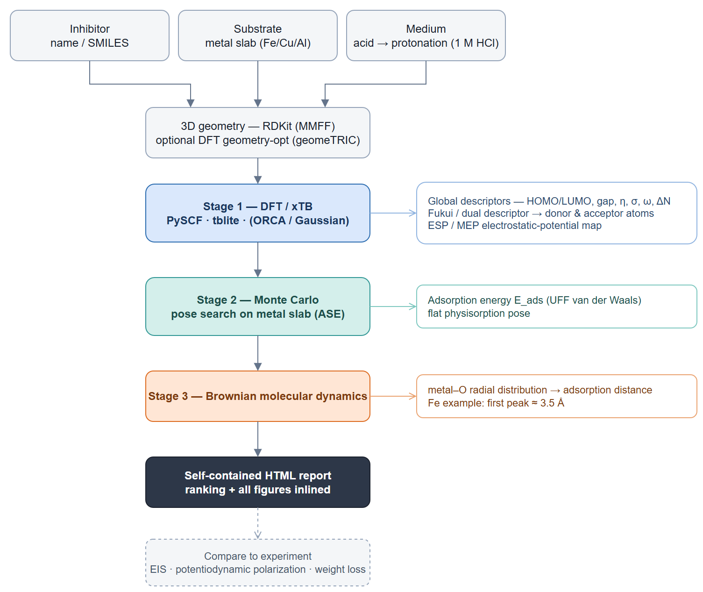

# corrosim

Automated screening of green corrosion inhibitors: take a molecule (name or
SMILES) and a metal, get reactivity descriptors, an adsorption estimate, a
ranking, and a report — all on free, open-source software.

Built around the **Arghel (*Solenostemma argel*) flavonoids** (kaempferol,
quercetin, isorhamnetin), but it accepts any molecule.


## Pipeline

A full open-source multiscale screen: electronic structure → adsorption pose →
dynamics → report.



*Diagram source: [`docs/pipeline.drawio`](docs/pipeline.drawio) — edit in
[diagrams.net](https://app.diagrams.net), re-export with
`drawio -x -f png -s 2 -o figures/fig0_pipeline.png docs/pipeline.drawio`.*

| Stage | What | Tool | Status |
|---|---|---|---|
| 1 | Global reactivity descriptors | tblite (xTB), PySCF, ORCA/Gaussian | ✅ |
| 1 | DFT geometry optimisation | PySCF + geomeTRIC | ✅ (`run_dft --optimize`) |
| 1b | Local reactivity — Fukui / dual descriptor | PySCF | ✅ |
| 1c | ESP / MEP map | PySCF cubegen + skimage | ✅ |
| 2 | Monte Carlo adsorption pose search | UFF van der Waals (built-in) | ✅ |
| 3 | Brownian MD → Fe–O RDF / adsorption distance | built-in | ✅ (physisorption proxy) |
| 3+ | Quantitative chemisorption E_ads | LAMMPS (EAM+GAFF) or periodic DFT | 🔌 hand-off (runs outside) |

The scientific basis — the methodology, the descriptor equations, the engine
choices, and how each stage maps to the code — is in
[`docs/pipeline.md`](docs/pipeline.md). Results vs. published Fe(110) studies
(and the FF-vs-DFT-geometry robustness check) are in
[`docs/validation.md`](docs/validation.md).

### Reproduce the multiscale pipeline

The `corrosim.runs.*` drivers run each stage and write data to `results/`,
figures to `figures/`, and volumetric cubes to `cubes/`. The DFT/xTB stages need
the QM engines (see the Docker path under [Install](#install)); the rest run in a
plain venv.

```bash
python -m corrosim.runs.run_dft   --out-csv results/dft_descriptors.csv            # Stage 1 descriptors
python -m corrosim.runs.run_fukui                                                  # Stage 1b — Fukui
python -m corrosim.runs.make_cubes --what orbital,esp                              # HOMO/LUMO + ESP cubes
python -m corrosim.runs.run_mc                                                     # Stage 2 — MC poses
python -m corrosim.runs.run_md                                                     # Stage 3 — Brownian MD / RDF
python -m corrosim.runs.make_figures                                               # render the figure set
python -m corrosim.runs.make_report                                                # one self-contained report.html
```

## Install

```bash
git clone https://github.com/braboj/corrosim
cd corrosim
pip install -e ".[qm,viz]"  # core + QM engines + figure rendering
```

`rdkit`, `ase`, `tblite`, `pyscf` ship pip wheels on Linux/macOS; if a wheel is
missing on your platform, install that one via conda
(`conda install -c conda-forge rdkit pyscf tblite`).

The `viz` extra (`scikit-image`, `scipy`, `Pillow`) powers the orbital/ESP
isosurface figures and is bundled into `[dev]`, so the test suite can render them.

**Quantum engines via Docker (recommended on Windows).** PySCF/tblite have no
native-Windows wheels, so the DFT/xTB stages run in the bundled `corrosim-qm`
image; everything else (MC, MD, figures, report, tests) runs in a plain venv.

```bash
docker compose build qm                                    # build once
docker compose run --rm qm pytest -q                       # smoke test
docker compose run --rm qm python -m corrosim.runs.run_dft --out-csv results/dft_descriptors.csv
```

The repo is bind-mounted at `/work`, so outputs land back in `results/` / `figures/`
and code edits need no rebuild. Long jobs (geometry-opt, MEP cubes) should be run
detached (`docker compose run -d --name <job> qm …`) so they survive a shell exit.

## Use

**Command line / batch CSV**
```bash
corrosim --input examples/molecules.csv --metal "Fe(110)" \
         --engine xtb --adsorption --out report.html --csv results/screen.csv
```
CSV columns: `name` (and optional `smiles`).

**Python**
```python
import corrosim
df, html = corrosim.screen(
    ["kaempferol", "quercetin", "isorhamnetin"],
    metal="Fe(110)", engine="xtb", adsorption=True,
    out_html="corrosion_report.html",
)
print(corrosim.rank_inhibitors(df))
```

### Engines
- `xtb` — GFN2-xTB, sub-second, for ranking (open-source).
- `pyscf` — real DFT (B3LYP etc.), minutes/molecule, for final numbers (open-source).
- `orca` / `gaussian` — write input, run your local binary, parse HOMO/LUMO:
  ```python
  corrosim.analyse_one("kaempferol", engine="orca",
                       keywords="B3LYP def2-TZVP", solvent="water",
                       orca_cmd="/path/to/orca")     # or set $ORCA_CMD
  ```
  ORCA is free for academic use; for the fully open path use `pyscf`.

## Project structure

```
corrosim/        package: molecules, engines, descriptors, fukui, mc, md,
                 adsorption, figures, report, cli, presets (case studies)
corrosim/runs/   stage drivers (run_dft/fukui/mc/md, make_cubes/figures/report,
                 compare_geometry)
results/         tracked output data (descriptors, Fukui, MC/MD json, comparison)
figures/         curated manuscript figure set (PNG)
cubes/           volumetric .cube files — regenerable, gitignored
report.html      self-contained pipeline report (make_report)
examples/        sample batch CSV
tests/           pytest suite (no DFT — fast)
docs/            pipeline.md, validation.md, ONBOARDING.md, PLAYBOOK.md,
                 dev-journal.md, decisions/ (ADRs)
Dockerfile,      the corrosim-qm QM environment (PySCF + tblite)
docker-compose.yml
```

## Development

```bash
pip install -e ".[dev]"
pytest
```

Tests are deliberately QM-light (descriptor math, parsers, CSV reader, slab/UFF,
one xTB smoke test) so CI stays fast. See `docs/decisions/` for design decisions — e.g.
why cluster-xTB was rejected for the adsorption energy.

## Limitations & roadmap

- The adsorption stages (MC pose search + Brownian MD) use a **UFF van-der-Waals
  model** (rigid bodies, no charge transfer): bounded and good for ranking and the
  physisorption distance, but **not a quantitative chemisorption E_ads**. That last
  step is the LAMMPS (EAM+GAFF) or periodic-DFT hand-off — *roadmap*.
- Geometry optimisation covers the **neutral** forms; a vibrational-frequency check
  (confirm true minima) and optimised **protonated** cations are *roadmap*.
- The flavonoids are **documented major constituents** of *S. argel*, simulated as
  representatives — confirm a specific extract with LC-MS/GC-MS.
- Simulations **screen and explain**; they don't prove efficiency. Validate with
  electrochemistry (EIS, polarization, weight loss).

## License

MIT © 2026 Branimir Georgiev
