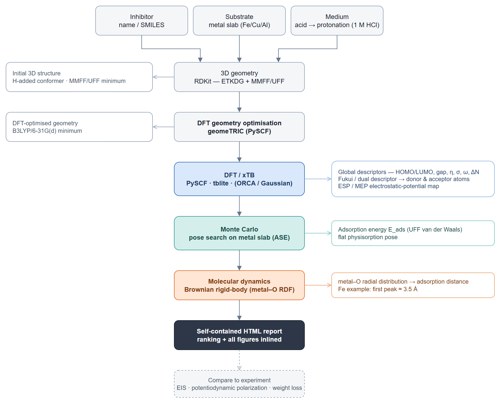

# How corrosim works — the simulation pipeline

*A plain-English guide to what this tool actually does, and the science behind
it. No computational-chemistry background needed — the technical detail is
layered in for those who want it, but you can follow the story without it.*

## Motivation

Metals corrode. Iron rusts, and in an acid — like the hydrochloric acid (HCl)
used industrially to clean steel — it dissolves alarmingly fast. A cheap,
practical defence is a **corrosion inhibitor**: a small amount of a molecule
added to the liquid that sticks to the metal surface and forms a thin protective
film, like a microscopic raincoat that keeps the corrosive acid off the metal.
**Green** inhibitors are ones drawn from plants instead of toxic synthetic
chemicals. The catch: there are thousands of candidate molecules, and testing
each one in the lab is slow and costly. **corrosim screens them on a computer
first**, so only the most promising candidates go to the bench.

## Inputs and outputs

You give corrosim three things (the three boxes at the top of the diagram):

- **an inhibitor** — the candidate molecule, given by name (e.g. `quercetin`) or
  as a *SMILES* string (a short text code for a chemical structure);
- **a substrate** — the metal you want to protect (mild steel / iron, copper, or
  aluminium);
- **a medium** — the corrosive liquid, e.g. 1 M HCl. This matters because in acid
  the molecule grabs an extra H⁺ and becomes positively charged, which changes
  how it behaves — so corrosim models that charged form too.

Out the other end comes a **ranking** of the candidates and a self-contained
HTML report: every number, chart, and 3D picture bundled into one shareable file.



*Source: [`diagrams/pipeline.drawio`](diagrams/pipeline.drawio) — edit in
[diagrams.net](https://app.diagrams.net); re-export steps are in
[`PLAYBOOK.md`](PLAYBOOK.md) (§ 4 Maintenance). The bottom of this page maps
each step to the code.*

## Pipeline overview

corrosim follows the diagram top to bottom — the same recipe that recurs across
the green-inhibitor literature. The first two steps build and refine a geometry to
work on; the rest are the screening proper, each asking a different question and
zooming from the lone molecule to the molecule sitting on metal:

- **3D geometry** — turn the input (a name or SMILES string) into a rough 3D
  structure. Runs once per molecule; independent of the metal and the medium.
- **DFT geometry optimisation** — refine that rough structure into a trustworthy
  quantum-mechanical minimum before anything is measured on it.
- **DFT — reactivity descriptors** — read the molecule's *global* and *local*
  reactivity from the optimised structure: *what kind of molecule is this?*
- **Monte Carlo** — *how does it like to sit on the metal?* Try many poses, keep
  the best.
- **Molecular dynamics** — *how tightly does it hold on?* Let it jiggle at room
  temperature and measure.

The screening steps are really chasing one thing: **how strongly the molecule
sticks to the metal** (its *adsorption*). The better it sticks and shields the
surface, the better it fights corrosion.

## 3D geometry

| | |
| --- | --- |
| **Why** | Everything downstream needs a concrete 3D shape to act on; a name or a SMILES string carries no coordinates. |
| **What it does** | Turns the input into a sensible *starting* geometry — cheap, classical, and approximate, not the final word — and builds the acid-protonated form (the extra-H⁺ cation) the same way. Runs once per molecule; independent of the metal and the medium. |
| **How** | Makes the SMILES's *implicit* hydrogens explicit (`AddHs` — SMILES leaves H's implied by valence, not as atoms), generates 3D coordinates for every atom (RDKit's ETKDG distance-geometry method), then tidies them with a quick force-field optimisation (MMFF, falling back to UFF). `corrosim/molecules.py` — `build_molecule`, `build_protonated`. |
| **Output** | An in-memory structure passed to the next step; not persisted as a standalone file. |

## DFT geometry optimisation

| | |
| --- | --- |
| **Why** | The force-field shape is only a rough draft; every descriptor below is read off this geometry, so it must be a genuine quantum-mechanical minimum before any number is trusted. |
| **What it does** | Re-optimises the starting geometry to a DFT energy minimum (default B3LYP/6-31G(d)). Because the choice of geometry can shift results, its robustness is checked — the FF-vs-DFT comparison in `docs/validation.md`. |
| **How** | `corrosim/engines.py` (`optimize_geometry`, PySCF + geomeTRIC), driven by `run_dft --optimize`; the geometry comparison by `corrosim/runs/compare_geometry.py`. |
| **Output** | Descriptors on the optimised geometry in `results/dft_descriptors_opt.{csv,json}`; the robustness table in `results/geometry_comparison.csv`. |

## DFT — global and local reactivity descriptors

| | |
| --- | --- |
| **Why** | Gripping a metal surface is largely about donating electrons into it, so an "electron-generous" molecule tends to be a better inhibitor; here we characterise the isolated molecule's willingness to share electrons. |
| **What it does** | Reads the molecule's reactivity from its DFT electronic structure — *global* numbers for the whole molecule (below) and *local* ones that pinpoint the binding atoms (further below). |
| **How** | Solves the quantum-mechanical equations for the molecule's electrons (**DFT**, density functional theory — an X-ray of its electronic personality) with one of four interchangeable engines: `xtb` (very fast, first pass), `pyscf` (open-source DFT, the publication-grade default), and optional `orca` / `gaussian`. The literature typically uses commercial Gaussian (B3LYP, 6-311++G(d,p), implicit water) or DMol³; corrosim matches that level with free tools. |
| **Output** | Split across the two subsections below (`results/dft_descriptors*.{csv,json}`, `results/<molecule>_fukui.json`, `cubes/`). |

The two most important numbers come from the molecule's *frontier orbitals*:

- **HOMO** — the highest-energy electrons it holds, i.e. the ones it is most ready
  to *give away*.
- **LUMO** — its lowest empty slot, i.e. where it can *accept* electrons back.

A high HOMO and a small **HOMO–LUMO gap** signal a reactive, electron-donating
molecule that bonds readily to metal.

### Global reactivity descriptors

From E_HOMO and E_LUMO a standard set of reactivity numbers (the *global
descriptors*) is derived. **You don't need the algebra** — the two to watch are
the **gap** (smaller = more reactive) and **ΔN** (roughly, how many electrons the
molecule tends to hand to the metal). The full set, for completeness (via
Koopmans' theorem):

```text
Energy gap            ΔE   = E_LUMO − E_HOMO          (smaller → more reactive)
Ionization potential  IP   = − E_HOMO
Electron affinity     EA   = − E_LUMO
Electronegativity     χ    = (IP + EA) / 2
Chemical hardness     η    = (IP − EA) / 2            (= ΔE / 2; softer adsorbs better)
Chemical softness     σ    = 1 / η
Chemical potential    µ    = − χ
Electrophilicity      ω    = µ² / (2η)
Electrons transferred ΔN   = (Φ_metal − χ) / [2 (η_metal + η)]
Back-donation energy  ΔE_back = − η / 4
```

The metal enters through its **work function** Φ — essentially how tightly it
holds its own electrons (Fe ≈ 4.82, Cu ≈ 4.94, Al ≈ 4.26 eV; we treat the metal's
hardness η_metal ≈ 0). Implemented in `corrosim/descriptors.py`; **output** in
`results/dft_descriptors.{csv,json}` (and `…_opt.{csv,json}` on the DFT geometry).

### Local reactivity descriptors

The descriptors above describe the *whole* molecule; we also want to know *which
individual atoms* latch onto the metal. Two tools answer that:

- **Fukui functions / dual descriptor** — flag the most reactive atoms (the
  electron donors and acceptors).
- **ESP map** — a 3D "heat map" of charge across the molecule; the red, electron-
  rich patches are the spots that love metal.

For the Arghel flavonoids both agree: the oxygen atoms on the catechol ring and
the 3-OH group are the metal-binding sites. Implemented in `corrosim/fukui.py`
(condensed Fukui, by frozen-orbital or finite-difference) and
`figures.render_esp` (PySCF `cubegen` density + electrostatic potential, painted
onto the molecule's surface). **Output:** per-molecule
`results/<molecule>_fukui.json` (Fukui); volumetric
`cubes/<molecule>_{density,esp,homo,lumo}.cube` (ESP/orbitals, gitignored).

## Monte Carlo — adsorption pose search

| | |
| --- | --- |
| **Why** | Reactivity alone doesn't say how the molecule actually sits on the metal; we need its best adsorption geometry and binding strength. |
| **What it does** | Finds the lowest-energy pose (position + orientation) on the metal surface and reports its **adsorption energy** E_ads (more negative = stronger grip). For the flavonoids on steel they lie **flat** at E_ads ≈ −16 kJ/mol — weak "physical" sticking (*physisorption*), consistent with published plant-inhibitor results. |
| **How** | Builds a realistic metal surface (a periodic "slab") with ASE, then runs a Monte Carlo / *simulated-annealing* pose search over a van-der-Waals stickiness model (UFF): randomly nudge and rotate the molecule thousands of times, generally keeping energy-lowering moves but occasionally accepting a worse one to escape a so-so spot. `corrosim/adsorption.py` + `corrosim/mc.py`; the literature uses Materials Studio's Adsorption Locator for the same role. |
| **Output** | `results/mc_adsorption.json`. |

> A tempting shortcut — a tiny metal *cluster* scored with the fast `xtb` engine —
> was tried and **rejected**: bare clusters give wildly unphysical energies. See
> [ADR 0001](adr/0001-reject-cluster-xtb-adsorption-energy.md).

## Molecular dynamics — adsorption distance (metal–O RDF)

| | |
| --- | --- |
| **Why** | A single best pose is just a snapshot; real molecules wiggle at temperature, so we check how the molecule actually settles and how far it sits from the metal. |
| **What it does** | Lets the molecule move over the surface at room temperature (298 K) and reports the **adsorption distance** from the **metal–O radial distribution function (RDF)** — its first peak marks the typical binding distance (closer than ~3.5 Å → *chemisorption*; farther → *physisorption*). For the flavonoids the Fe–O first peak sits at ≈ 3.5 Å, the physisorption range, agreeing with the Monte Carlo step. |
| **How** | Runs a light **Brownian molecular dynamics** under the same van-der-Waals field and reads the metal–O RDF. `corrosim/md.py`. For a *quantitative, bond-capable* E_ads, corrosim hands off to **LAMMPS** (recipe in `LAMMPS_HANDOFF_NOTE`; GAFF/OPLS + EAM, explicit water) — the heavy job deliberately left outside the package. |
| **Output** | `results/md_rdf.json`. |

## Open-source tooling

The reference papers lean on Gaussian and BIOVIA Materials Studio — both
expensive commercial packages. corrosim reproduces the whole pipeline with free,
open-source tools, so it costs **$0 in licences**:

| Reference (commercial) | Free equivalent used here |
|---|---|
| Gaussian / DMol³ (DFT) | PySCF, xTB (ORCA optional, free for academia) |
| DMol³ geometry-opt | PySCF + geomeTRIC (`run_dft --optimize`) |
| Adsorption Locator (MC) | ASE slab + UFF Monte Carlo pose search (`corrosim/mc.py`) |
| Forcite (MD) | Brownian rigid-body MD → metal–O RDF (`corrosim/md.py`); LAMMPS hand-off for quantitative E_ads |
| Multiwfn (Fukui / ESP) | `corrosim/fukui.py` (condensed Fukui) + PySCF cubegen ESP/MEP map |

The takeaway: your compute goes into the **DFT stage** (and the optional LAMMPS
hand-off for a quantitative E_ads), never into software licences.

## Implementation map

| Step | Module | Entry points |
|---|---|---|
| 3D geometry | `corrosim/molecules.py` | `build_molecule`, `build_protonated` (SMILES → 3D → FF optimise) |
| DFT geometry optimisation | `corrosim/engines.py` | `optimize_geometry` (PySCF + geomeTRIC) |
| DFT engines | `corrosim/engines.py` | `run_xtb`, `run_pyscf`, `run_orca`, `run_gaussian` |
| DFT — global descriptors | `corrosim/descriptors.py` | `compute_descriptors` |
| DFT — local descriptors | `corrosim/fukui.py`, `corrosim/figures.py` | `compute_fukui`; `write_density_esp_cubes`, `render_esp`, `render_orbital` |
| Monte Carlo | `corrosim/adsorption.py`, `corrosim/mc.py` | `build_adsorption_system`, `run_mc` |
| Molecular dynamics | `corrosim/md.py` | `run_md` |
| Reporting | `corrosim/report.py` (+ `report_layout`, `report_content`, `report_docx`) | `rank_inhibitors`, `build_html_report`, `build_pipeline_report` |
| Drivers | `corrosim/runs/*` | `run_dft`, `run_fukui`, `run_mc`, `run_md`, `make_cubes`, `make_figures`, `make_report`, `compare_geometry` |
| Orchestration | `corrosim/__init__.py`, `cli.py` | `screen`, `analyse_one` |

## Scope and limitations

- Simulations **screen and explain**; they do not *prove* that a molecule works.
  Always confirm the promising candidates with real electrochemistry — EIS,
  potentiodynamic polarization, and weight-loss tests.
- For a plant extract like Arghel (*Solenostemma argel*), we don't simulate the
  whole mixture — only its **major known ingredients** (here the flavonoids
  kaempferol, quercetin, isorhamnetin). What is actually in a given batch should
  be confirmed by LC-MS/GC-MS.
